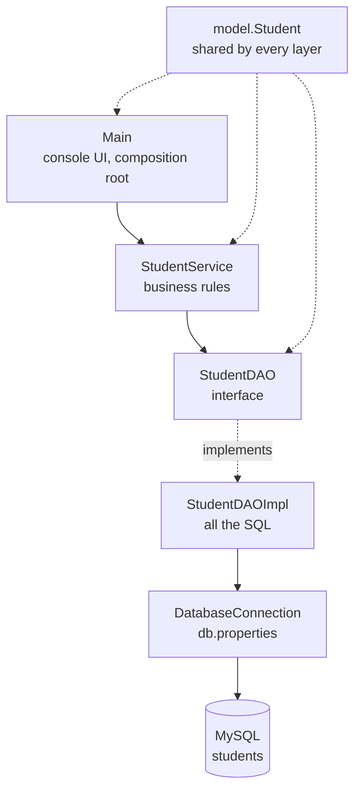

# Student Management System

A console CRUD application built with **plain JDBC** — no Spring, no ORM — as a
deliberate exercise in Java backend fundamentals. The point of this project is not the
feature set; it is that every layer is explicit, so each one can be explained rather than
assumed.

---

## Features

| # | Feature | Notes |
|---|---------|-------|
| 1 | Add student | Validates, normalises, rejects duplicate emails |
| 2 | View all students | Ordered by id |
| 3 | Find student by id | Reports a clear error when the id is unknown |
| 4 | Search students | Case-insensitive partial match on name **or** course |
| 5 | Update student | Cannot steal another student's email |
| 6 | Delete student | Requires typed confirmation |

**Student fields:** `id`, `name`, `email`, `phone`, `age`, `course`

---

## Tech stack

| Technology | Version | Why |
|-----------|---------|-----|
| Java | 17 (LTS) | `record`s, text blocks, arrow `switch`, `String.strip()` |
| Maven | 3.9 | Dependency management and the standard build lifecycle |
| MySQL | 8.0 | `CHECK` constraints, `utf8mb4`, `AUTO_INCREMENT` |
| MySQL Connector/J | 8.4.0 | The JDBC driver |
| JDBC | built into the JDK | The point of the exercise |

No Spring, no Hibernate, no Lombok, no logging framework. Every dependency here has to
earn its place.

---

## Architecture

Four layers, and each one only knows about the layer beneath it.

```
        Main  (console UI)
          |            reads input, prints output, holds no rules
          v
    StudentService     business rules, validation, normalisation, exception policy
          |            depends on the StudentDAO *interface*, never on MySQL
          v
      StudentDAO       the contract: what operations exist
    StudentDAOImpl     the only class that knows SQL exists
          |
          v
   DatabaseConnection  reads db.properties, hands out Connections
          |
          v
        MySQL          student_management.students
```



**Two rules make the whole thing work:**

1. **Dependencies point downward and inward.** `Student` imports nothing. `Main` imports
   the service. The service imports the DAO interface. Only `StudentDAOImpl` imports
   `java.sql`. Reverse an arrow and the design collapses.
2. **Each layer changes for a different reason.** Business rule changes touch the service.
   Storage changes touch the DAO. Presentation changes touch `Main`. No change touches
   two layers by accident.

### Project structure

```
student-management-system/
├── pom.xml
├── .gitignore
├── db/
│   └── schema.sql                     the database, as code
├── src/main/
│   ├── java/com/sms/
│   │   ├── Main.java                  console menu + composition root
│   │   ├── model/
│   │   │   └── Student.java           plain data holder, 6 fields
│   │   ├── dao/
│   │   │   ├── StudentDAO.java        the contract
│   │   │   └── StudentDAOImpl.java    the SQL
│   │   ├── service/
│   │   │   └── StudentService.java    the rules
│   │   ├── exception/
│   │   │   ├── ValidationException.java
│   │   │   ├── DuplicateEmailException.java
│   │   │   ├── StudentNotFoundException.java
│   │   │   └── DataAccessException.java
│   │   └── util/
│   │       └── DatabaseConnection.java
│   └── resources/
│       └── db.properties              NOT committed
└── README.md
```

---

## One request, end to end

Adding a student is the clearest way to see the layers cooperate:

```
User types "1"
  -> Main.addStudent() reads five lines and builds a Student
  -> StudentService.addStudent(student)
       1. cleanUp()                 strip whitespace, lower-case the email
       2. validate()                shape rules: blanks, email format, phone digits, age 15-100
       3. requireEmailAvailable()   asks the DAO whether the email is taken
       4. studentDAO.insert()       only now does MySQL get touched
  -> StudentDAOImpl builds the INSERT, binds five parameters, reads the generated key
  -> DatabaseConnection.getConnection() provides the Connection
  -> MySQL assigns an AUTO_INCREMENT id and returns it
  -> the id travels back up and Main prints "Saved. The database assigned id 15"
```

A request can be stopped at step 2 or step 3 and **never reaches the database**.

---

## Database setup

```bash
mysql -u root -p < db/schema.sql
```

Verify it applied correctly — you should see all three named constraints:

```sql
USE student_management;
SHOW CREATE TABLE students;
```

Expected:

```sql
PRIMARY KEY (`id`),
UNIQUE KEY `uq_students_email` (`email`),
CONSTRAINT `chk_students_age` CHECK ((`age` between 15 and 100))
) ENGINE=InnoDB DEFAULT CHARSET=utf8mb4 COLLATE=utf8mb4_0900_ai_ci
```

---

## Configuration

Credentials live in `src/main/resources/db.properties`, which is **git-ignored**:

```properties
db.url=jdbc:mysql://localhost:3306/student_management?sslMode=DISABLED&allowPublicKeyRetrieval=true
db.username=root
db.password=your-password-here
```

Create your own copy after cloning. In a team, commit a `db.properties.example` with
placeholder values instead.

Why those two URL parameters: MySQL 8 authenticates with `caching_sha2_password`, and with
TLS disabled the driver must fetch the server's public key to encrypt the password —
`allowPublicKeyRetrieval=true` permits that. Without it you get
*"Public Key Retrieval is not allowed."*

---

## Build and run

```bash
# compile
mvn compile

# run the console app
mvn exec:java

# or run it directly
mvn -q dependency:build-classpath -Dmdep.outputFile=target/cp.txt
java -cp "target/classes;$(cat target/cp.txt)" com.sms.Main
```

> **Windows note:** if `mvn` is not on your `PATH`, call the Maven launcher by full path.
> Under Git Bash the `mvn` shell script fails; use `mvn.cmd` instead.

### Sample session

```
=== Student Management System ===

  1. Add student
  2. View all students
  3. Find student by id
  4. Search students
  5. Update student
  6. Delete student
  0. Exit
Choose an option: 1
  Name  :    Ravi Kumar
  Email :   RAVI@Example.COM
  Phone : 9812345670
  Age   : 21
  Course:   Java
  Saved. The database assigned id 15

Choose an option: 2
  1 student(s):
    Student{id=15, name='Ravi Kumar', email='ravi@example.com', phone='9812345670', age=21, course='Java'}
```

Note what happened: the leading spaces and the upper-case email were cleaned up by the
**service**, not by the menu.

Error handling:

```
Choose an option: 1
  ...
  Age   : 5
  ! Age must be between 15 and 100, got 5

Choose an option: 1
  ...
  Email : ravi@example.com
  ! Email ravi@example.com is already used by student id 15

Choose an option: 3
  Student id: 999999
  ! No student found with id 999999

Choose an option: abc
  "abc" is not a whole number.
```

---

## Design decisions

| Decision | Reasoning |
|----------|-----------|
| `Long id`, not `long` | A new student has **no** id. `long` would default to `0`, indistinguishable from a real id. `Long` defaults to `null` = "not saved yet". |
| Surrogate key, not `email` | A primary key must be immutable. Emails change. Also `BIGINT` (8 bytes) vs `VARCHAR(150)` — InnoDB copies the PK into every secondary index. |
| `phone VARCHAR(15)` | It is an identifier, not a quantity. `BIGINT` destroys leading zeros and cannot store `+91`. |
| `email UNIQUE` **and** a Java check | The Java check gives a friendly message; the database constraint is the only thing that is **atomic** under concurrency. Check-then-act in Java alone has a race window. |
| `age` stored directly | Deliberately the *wrong* real-world choice, kept for simplicity. Production would store `date_of_birth` — derived data that needs refreshing is a bug factory. |
| `course` as a column | A 3NF violation, accepted on purpose. Normalising it would add a `JOIN` to every read for no benefit at this size. The trade-off is named, not hidden. |
| `created_at` / `updated_at` in SQL | MySQL maintains them via `DEFAULT CURRENT_TIMESTAMP` and `ON UPDATE`. Zero Java code, impossible to forget. |
| No `equals` / `hashCode` on `Student` | Not needed until `Student` goes into a `HashSet` or becomes a `Map` key. |
| No `record` for `Student` | Records are immutable and use `id()` accessors; we need setters and JavaBeans-style getters. A record would be the better choice for a read-only DTO. |
| DAO declares `throws SQLException` | It is the layer that speaks JDBC; hiding the failure there would turn "the database is down" into "no students found". |
| Service catches and wraps | **Exception translation.** Nothing above the service imports `java.sql`. The original exception is preserved as the cause. |
| `update` returns `boolean` | `UPDATE ... WHERE id = 999999` affects zero rows and succeeds. `void` would let the app report success for a student that doesn't exist. |
| `deleteById` requires confirmation in the UI | Destructive actions get an explicit gate. |
| Read lines, parse them yourself | `Scanner.nextInt()` leaves the newline in the buffer, so the next `nextLine()` returns `""` and a question appears to be skipped. |

---

## Exception strategy

```
RuntimeException
├── ValidationException          input is malformed          -> user must fix it
├── DuplicateEmailException      input conflicts with data   -> user must fix it (409, not 400)
├── StudentNotFoundException     the target id does not exist -> user must fix it
└── DataAccessException          the database failed         -> user cannot fix it
    └── cause: the original java.sql.SQLException (SQLState + error code preserved)
```

All four are **unchecked**, on purpose. The immediate caller cannot repair a bad email
address — only the person who typed it can — so forcing `throws` on every method would
produce `catch` blocks that nobody can act on. The UI handles them at **one boundary**
(`Main.handleMenuChoice`), which separates the two failures that actually matter:

- the user's problem → print the message and carry on
- our problem → apologise, and keep the technical detail for the log

`SQLException` stays **checked** at the DAO, because it is JDBC's signature and we do not
get to choose it. We translate it into `DataAccessException` at the service boundary —
which is exactly what Spring's `DataAccessException` hierarchy does.

---

## Deliberately not included

No web layer, no authentication, no ORM, no connection pool, no logging framework, no unit
tests, no pagination, no audit history. Each one would be a separate lesson, and adding
them now would hide the fundamentals this project exists to teach.

## Where this goes next

1. **Connection pooling (HikariCP).** `DriverManager.getConnection()` opens a new TCP
   connection and performs a full auth handshake every call — 5–50 ms. Fine here, fatal
   under load. This is a change to `DatabaseConnection` only, which is the payoff of
   putting connection creation behind one class.
2. **Unit tests with a fake DAO.** `StudentService` depends on the `StudentDAO`
   *interface*, so every rule can be tested with an in-memory implementation and no
   database. This is the entire reason the interface exists.
3. **Pagination** for `findAll` — never return an unbounded list from a real database.
4. **A REST layer** — replace `Main` with a controller. Every rule survives untouched.
5. **Flyway or Liquibase** — version the schema instead of running `schema.sql` by hand.
6. **Structured logging** instead of `System.out`.
